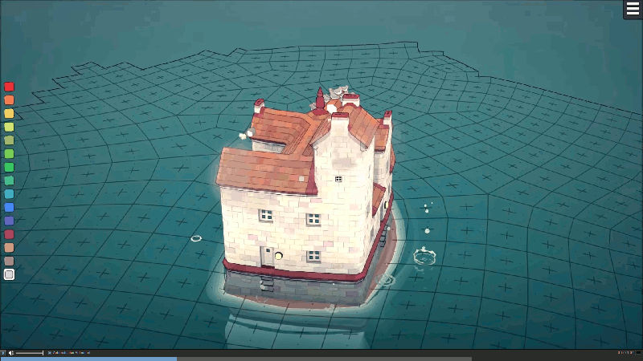
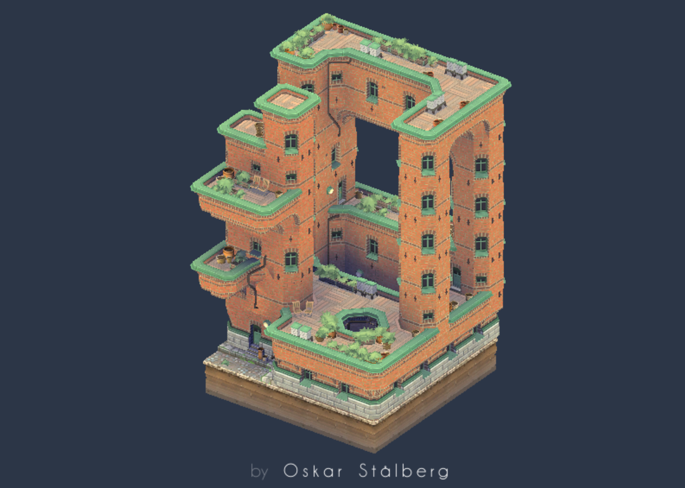
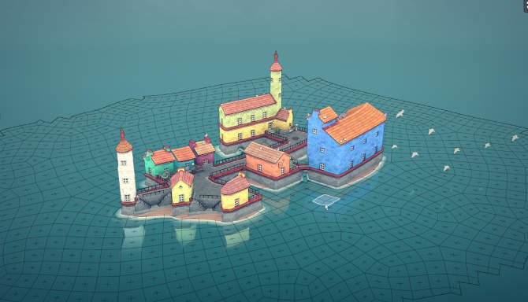

{width="300px"}
{width="300px"}
{width="300px"}

# Title and Summary

We want to implement a wave function tiling algorithm to create cute and coherent scenes in 3D. Also, we want to make this on multiple z-axis stages where the structures remain coherent and nicely arrange in our world.

# Goals and Deliverables

* Core of the project:
  * We want to implement a wave function tiling algorithm on a **finite length** tile.
  * We want to make a **set of 3D tiles** arranging smoothly together based on a wave function.
  * Every start of the project should yield a **new kind of arrangement** based on random base conditions.
  * Render our world using **Phong Shading** on textures.

* Extensions of the project
  * Create a **user interface** so the user can generate their own buildings/structures with mouse.
  * Add a **moving light source** to show different types of shadows and highlights on the structure (e.g.: day/night).
  * Add **surrounding water or other landscaping** and shade or reflect according to the structure.

# Schedule

* Until _06.05.21_
  * Create the project base, namely the world with a fixed tile and a camera looking at it (based on previous exercices).
  * Create a set of tiles in blender that will represent our basis for the tile generation.
  * Manage to render the tiles and Phong Shading in our world
* Until _13.05.21_
  * Make our tiles able to passe through a Wave Collapse function algorithm (label the faces between others).
  * Try an implementation of the algorithm without considering the Z multiple levels.
* Until _20.05.21_
  * Produce the tiling algorithm in 3D in our world.
  * Start the extensions after evaluating the most feasibile.
* Until _27.05.21_
  * Continue the extensions.
  * Prepare the video deliverable.

# Resources

We'll probably many other ressources but here is our basis:

 * [Wave function collapse implementation](https://github.com/mxgmn/WaveFunctionCollapse)
 * [Youtube video explanation on 3D wave function collapse algorithm](https://www.youtube.com/watch?v=2SuvO4Gi7uY&)
